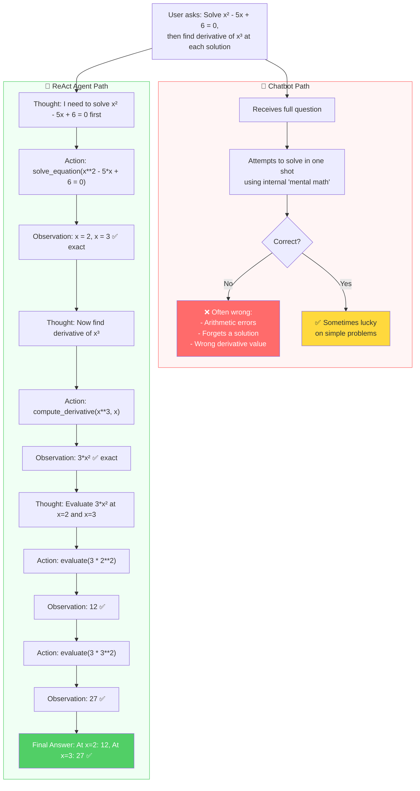

# Flowchart: Where the Agent Adds Value

## Overview

This diagram shows the decision flow for both the Chatbot and the ReAct Agent when handling a math query, highlighting exactly where the Agent's tool-calling ability produces correct results that the Chatbot cannot.

## Flow Diagram

## Where the Agent Wins

| Step | Chatbot | Agent | Why Agent Wins |
|------|---------|-------|----------------|
| **Equation solving** | Guesses roots, may miss one | `solve_equation` → exact symbolic solution | Sympy is provably correct |
| **Differentiation** | May misapply rules on complex expressions | `compute_derivative` → exact symbolic result | No human error possible |
| **Arithmetic** | Mental math errors on large numbers | `evaluate` → precise computation | Calculator vs brain |
| **Multi-step** | All errors compound | Each step verified independently | Error isolation |

## Where the Chatbot Wins (or ties)

| Scenario | Why |
|----------|-----|
| Simple factual math ("What is 2+2?") | LLM knows this from training data |
| Conceptual explanations ("What is a derivative?") | No computation needed |
| Word problems (understanding the question) | LLM's strength is language comprehension |

## Key Insight

> The agent doesn't replace the LLM's reasoning — it **augments** it with verified computation.
> The LLM still decides *what* to compute; the tools ensure *how* it's computed is correct.
